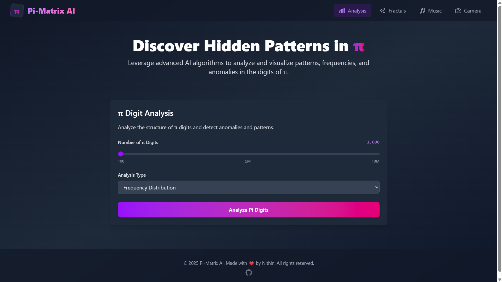
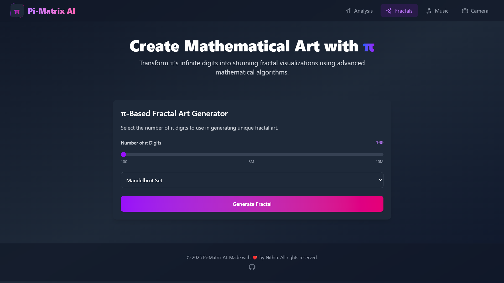
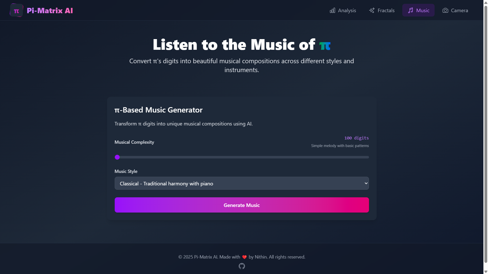
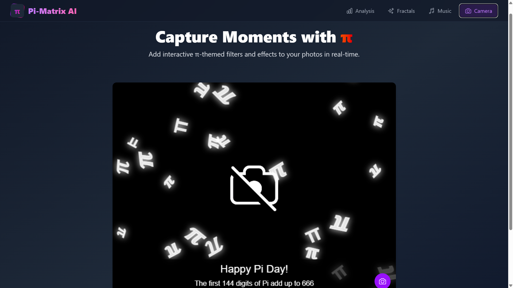

# Pi-Matrix AI 🚀






A sophisticated web application that explores the mathematical beauty of π (pi) through AI-powered analysis, visualization, music generation, and interactive features.

## 🌟 Features

### 1. Pi Analysis Engine 📊
- **Frequency Distribution**: Advanced statistical analysis of digit frequencies
- **Pattern Detection**: AI-powered identification of mathematical patterns
- **Anomaly Detection**: Statistical analysis for unusual sequences
- **Interactive Visualizations**: Dynamic charts and graphs for data representation

### 2. Fractal Art Generator 🎨
- **Mandelbrot Set**: Pi-influenced Mandelbrot fractal generation
- **Julia Set**: Dynamic Julia set visualizations
- **Custom Parameters**: Pi-based parameter modifications
- **High-Resolution Output**: Professional quality fractal images

### 3. Pi Music Composer 🎵
- **Multiple Styles**: Classical, Jazz, Electronic, and Ambient
- **Real-time Playback**: Built-in MIDI player
- **Custom Instruments**: Various soundfont instruments
- **Download Options**: Save compositions as MIDI files

### 4. Pi Camera Filter 📸
- **Real-time Effects**: Pi-themed overlay effects
- **Falling Symbols**: Dynamic π symbol animations
- **Pi Facts**: Rolling educational facts about π
- **Image Capture**: Save filtered photos instantly

## 🛠️ Tech Stack

### Frontend
- React.js with Vite
- Framer Motion for animations
- Tailwind CSS for styling
- Heroicons for icons
- Web APIs (Camera, Audio)

### Backend
- FastAPI (Python)
- Google Generative AI
- NumPy & SciPy
- Matplotlib for visualizations
- PIL for image processing

### AI/ML
- Google Gemini for analysis
- Custom pattern recognition algorithms
- Statistical analysis tools

## 📦 Installation

1. **Clone the Repository**
```bash
git clone https://github.com/nithin-developer/pi-matrix-ai.git
cd pi-matrix-ai
```

2. **Backend Setup**
```bash
cd backend
python -m venv venv
source venv/bin/activate  # On Windows: venv\Scripts\activate
pip install -r requirements.txt
```

3. **Frontend Setup**
```bash
cd frontend
npm install
```

4. **Environment Variables**
```bash
# Backend (.env)
GOOGLE_API_KEY=your_gemini_api_key
DATABASE_URL=sqlite:///./pi_matrix.db

# Frontend (.env)
VITE_API_URL=http://localhost:8000
```

5. **Run the Application**
```bash
# Terminal 1 (Backend)
cd backend
uvicorn app:app --reload

# Terminal 2 (Frontend)
cd frontend
npm run dev
```

## 🚀 Usage

1. **Pi Analysis**
   - Select number of digits (100-10M)
   - Choose analysis type
   - View interactive visualizations
   - Export results

2. **Fractal Generation**
   - Select fractal type
   - Adjust parameters
   - Generate high-quality images
   - Download artwork

3. **Music Composition**
   - Choose musical style
   - Set digit count
   - Play/pause composition
   - Download MIDI file

4. **Camera Filters**
   - Allow camera access
   - Apply real-time filters
   - Capture photos
   - Save with effects

## 🤝 Contributing

1. Fork the repository
2. Create your feature branch (`git checkout -b feature/AmazingFeature`)
3. Commit changes (`git commit -m 'Add AmazingFeature'`)
4. Push to branch (`git push origin feature/AmazingFeature`)
5. Open a Pull Request

## 📄 License

This project is licensed under the MIT License - see the [LICENSE](LICENSE) file for details.

## 👨‍💻 Author

**Nithin**
- GitHub: [@nithin-developer](https://github.com/nithin-developer)

## 🙏 Acknowledgments

- Google Generative AI team for Gemini API
- The mathematical community for π research
- Open-source community for various tools and libraries

---

<p align="center">Made with ❤️ by Nithin</p>
